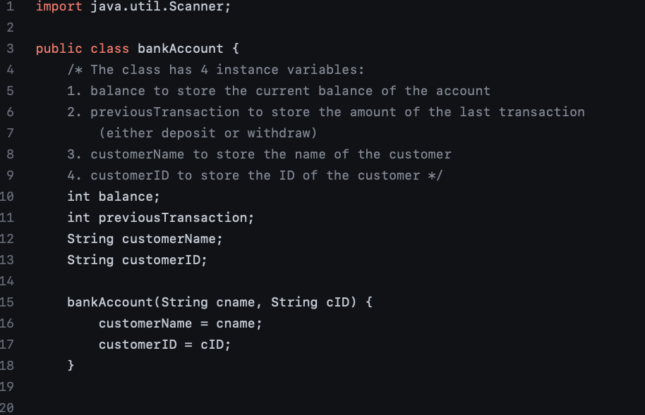
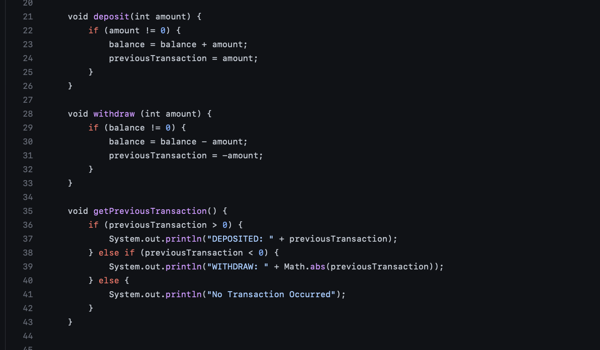

# Withdraw, Deposit & check your balance in the NEW Java Banking App 

## public class bankAccount

First, we create a bankAccount class with 4 instance variables we'll be using thorughout the program:
1. int balance;
2. int previousBalance; 
3. String customerName;
4. String customerID;

> underneath that, we create our bankAccount constructor with 2 params.

## deposit, withdraw & getPreviousTransaction methods 

Next we create 3 methods that give our application functionaility yo do things.
- deposit(), withdraw() and getPreviousTransaction() are comprised of math equations that fulfill each of their expected functions. 
- Later down the line the `int amount` variable will equal `scan.nextInt()` - the user's next int input.

### Technologies and Protocols:
* 

### What the heck is ___?

## Overview:

## Step 1: [Download](https://www.virtualbox.org/wiki/Downloads "Virtual Box")

